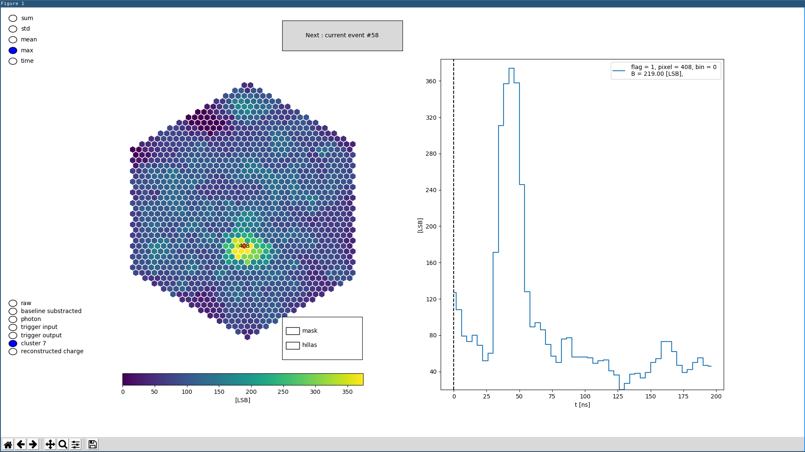

# digicampipe [](https://travis-ci.org/cta-sst-1m/digicampipe)
DigiCam pipeline based on ctapipe

The documentation can be found here: [Digicampipe documentation](https://cta-sst-1m.github.io/digicampipe)

# Installation

 * install Anaconda
 * `git clone https://github.com/cta-sst-1m/digicampipe`
 * `conda env create -f digicampipe/environment.yml`
 * `source activate digicampipe`
 * `pip install -e digicampipe`
 * `pytest digicampipe/digicampipe`

## Long Form

### Anaconda

You'll need Anaconda, so if you don't have it yet, just install it now.
Follow [the anaconda installation instructions](https://conda.io/docs/user-guide/install/linux.html).
We propose to use the most recent version.

    wget https://repo.continuum.io/archive/Anaconda3-5.0.0.1-Linux-x86_64.sh
    bash ./Anaconda3-5.0.0.1-Linux-x86_64.sh

### digicampipe

We propose to have a tidy place and clone `digicampipe` into a folder `ctasoft/`

    mkdir ctasoft
    cd ctasoft
    git clone https://github.com/cta-sst-1m/digicampipe

To not mix up your anaconda root environment with digicampipe, we propose
to make a so called environment, with all the dependencies in it.

### Create new environment

```
conda env create -f digicampipe/environment.yml
```

### Update your environment
This is usefull when new packages are added to the `environment.yml`

```
conda env update -f digicampipe/environment.yml
```


### Activate the anaconda environment

```
source activate digicampipe
```

**Please Note**: When working with digicampipe, please always make sure you are really using the `digicampipe` environment. After `source activate digicampipe`
your prompt should look similar to this this:

    (digicampipe) username@host:~/ctasoft$

    pip install -e digicampipe


### Execute the tests

    pytest digicampipe/digicampipe


## All Tests

Some tests depend on astrometry.net (see below) and take long, so by default you might want to skip them.
If you want to execute all tests, please do:

    pytest -c all_tests.ini

### Writing tests

To write tests please follow the instructions in the [Pytest-doc](https://docs.pytest.org/en/latest/getting-started.html).
It is important that you add the test resources to the repo. To do this add the resource path to "package_data=" in the setup.py
file.

## Build the documentation with [Sphinx](http://www.sphinx-doc.org/en/stable/) (optional)

In the `digicampipe` directory run:

    cd docs/
    make html

This should create the documentation in `digicampipe/docs/build/html`.
You can open the html files with your favorite web browser.
To delete the documentation us:

    make clean

# Software usage

## Mounting the data on your machine

You may want to mount the data from a remote onto your local machine. To do this
you can use `sshfs`. Information about `sshfs` can be found here
[sshfs](https://www.tecmint.com/sshfs-mount-remote-linux-filesystem-directory-using-ssh/)

Usage example :

```
sudo sshfs -o allow_other <username>@<remote_adress>:<remote_path> <local_path>
```

## Example: Viewer

With `digicampipe` comes the example program `digicam-view`. To use it, just go call it like this:
```
dneise@lair:~/sst/data$ digicam-view SST1M01_20171030.066.fits.fz
```

And you might see something like this:



## Pointing using lid CCD images

To be able to determine the pointing using stars reflections on the lid, astrometry.net is needed.
If not installed locally, the web service will be used instead.
To install astrometry.net:

    sudo apt-get install astrometry.net

You will need to download catalogs too:

    mkdir ~/astrometry-data
    cd ~/astrometry-data
    wget http://broiler.astrometry.net/~dstn/4200/wget.sh
    chmod +x wget.sh
    ./wget.sh

Grab a beer as it will take a while ... Also, indexes 4203 and lower are probably not needed.

Then add the folowing line to /etc/astrmetry.cfg:

    add_path ~/astrometry-data

That's it, you are ready to go.
